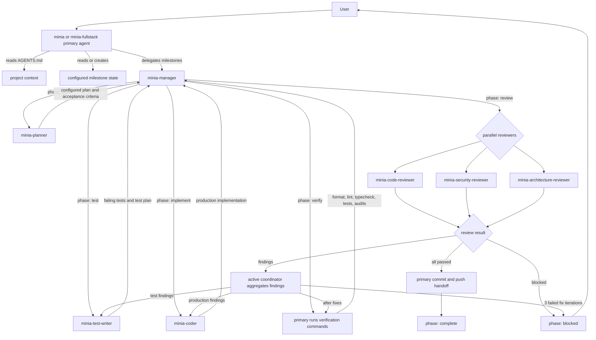

# Minia Agents

This repository contains global opencode agent definitions for the Minia Multi-Agent Loop Harness. Minia is a milestone-driven workflow that plans work, writes failing tests, implements the smallest production change, verifies the result, and sends the diff through parallel code, security, and architecture reviews before handoff.

The files in this directory are loaded by opencode as global agent definitions.

## Agents

| File | Agent | Role |
|------|-------|------|
| `minia.md` | `minia` | Primary user-facing entry point. Selects the active milestone, handles user communication, runs verification, and performs final commit/push handoff when requested by the orchestrator. |
| `minia-fullstack.md` | `minia-fullstack` | Full-stack web app primary user-facing entry point. Selects a supported stack profile, bootstraps projects such as TanStack Start or React + TanStack Router apps, records project context, then delegates milestone work to `minia-manager`. |
| `minia-manager.md` | `minia-manager` | General milestone manager. Coordinates planner, test-writer, coder, and reviewers across stacks. |
| `minia-planner.md` | `minia-planner` | Creates or refines the configured plan file, task breakdowns, risks, dependencies, and testable acceptance criteria. |
| `minia-test-writer.md` | `minia-test-writer` | Owns test code only. Writes failing tests for the project-configured test layers before implementation, plus test fixes during review loops. |
| `minia-coder.md` | `minia-coder` | Owns production code only. Implements the smallest correct change needed to satisfy the failing tests and acceptance criteria. |
| `minia-code-reviewer.md` | `minia-code-reviewer` | Reviews correctness, regressions, language/runtime quality, interface behavior, test gaps, and maintainability risks. |
| `minia-security-reviewer.md` | `minia-security-reviewer` | Reviews exploitable behavior, privilege escalation, tenant leakage, secrets, webhook trust boundaries, and audit gaps. |
| `minia-architecture-reviewer.md` | `minia-architecture-reviewer` | Reviews service boundaries, data flow, layering, repo ownership, scalability, and long-term maintainability. |

## Dynamic Skills

Minia agents keep their base prompts slim and load specialized skills only when the active project context requires them.

| Skill | Loaded By | Purpose |
|-------|-----------|---------|
| `minia-react-project-context-contract` | `minia-fullstack` | Defines React-specific `AGENTS.md` requirements before delegation to the manager. |
| `minia-react-parallel-task-planning` | `minia-planner` | Defines React task readiness, parallel grouping, shared-file serial rules, task templates, and clear `minia-coder` handoff criteria. |
| `minia-react-dispatch-safety` | `minia-manager` | Validates React task slices before parallel dispatch and blocks broad or conflicting tasks. |

### Skill Extension Model

The base Minia agents own only framework-neutral workflow contracts. Framework skills are complementary extensions, not replacements.

Base planner contract owns:

- Milestone state update shape.
- Base plan file sections.
- Base task slice fields.
- Base output contract.
- Base required test groups: `unit`, plus `e2e` when required by `PROJECT_CONTEXT`.
- Base optional test layers: `integration`, `contract`, `visual`, `accessibility`, `performance`, `security`, `smoke`, `public-interface`, `other`, and `none`.
- Generic parallel grouping, dependencies, conflicts, failure cases, and blockers.

Framework planning skills may extend only:

- Required test groups.
- Allowed test layers.
- Definition of Done items.
- Task slicing heuristics.
- Parallel group naming and conflict rules.
- Framework-specific target file and target test examples.
- Framework-specific blocker conditions.

Framework skills must not duplicate, replace, or weaken the base planner contract. They may only append stricter or more specific requirements when their trigger matches the active project context.

## Graphify Project Access Policy

All Minia agents that inspect active project code or docs use Graphify first unless the user explicitly disables Graphify for that project.

Policy:

- If project context says `Graphify: disabled_by_user`, agents must not run `graphify query` or `graphify update` for that project unless the user later explicitly re-enables it.
- Otherwise, agents must run `graphify query "<specific question>"` before `rg`, grep, glob, file-tree listing, broad direct reads, or other conventional project discovery.
- Conventional discovery is allowed only when `graphify query` errors, returns empty/no useful results, the graph is missing/not implemented, or exact line-level confirmation is needed after Graphify identifies relevant files.
- If Graphify is missing, not set up, or has no graph and no user decision is recorded, user-facing primary agents ask whether to set it up; subagents return `STATUS: BLOCKED` with `code: GRAPHIFY_SETUP_DECISION_REQUIRED` so the primary can ask.
- If the user declines setup, record `Graphify: disabled_by_user` in project context and never run `graphify query` or `graphify update` subsequently for that project.
- When `minia-manager` returns `STATUS: READY_FOR_COMMIT`, the active primary agent runs `graphify update` before git status/staging/commit/push only when Graphify is enabled. If Graphify policy is unknown, ask first. If the user declines, record `Graphify: disabled_by_user` and continue without Graphify.

## Workflow



## State Model

Each project using Minia must define its project-specific paths, names, commands, and conventions in its own `AGENTS.md`. The milestone state file named by that project context keeps state under an `Orchestrator State` section:

```markdown
### Orchestrator State
- phase: <plan | test | implement | verify | review | fix | commit | complete | blocked>
- iteration: <integer, 0-based, increments each fix loop>
- last_actor: <agent name>
- pending_agents: []
- completed_agents: []
- active_groups: []
- completed_groups: []
- blocked_groups: []
- active_tasks: []
- completed_tasks: []
- blocked_tasks: []
- findings: []
- blockers: []
- verification_output: {}
```

`minia-manager` manages this state machine for all Minia primary agents. It can edit the configured milestone state file and configured plan files, but it does not write production code, tests, or reviews directly.

## Project Context Contract

Every project should include an `AGENTS.md` section like this. All paths should be relative to the project root unless the user explicitly approves an external standards source.

```markdown
## Project Agent Context

### Project Identity
- Project type:
- Product name:
- Repository name:
- Organization/team:
- Primary domain terms:

### Product Docs
- PRD:
- TRD:
- UI/UX Design: # required for web frontend, dashboard, landing page, and mobile app; otherwise `none`

### Tech Stack Docs
- Programming language:
- Framework/project structure:
- Database: # required for non-static apps and any project with persistence; otherwise `none`
- Deployment:

### Project Constraints
- Constraint:

### Canonical Paths
- Milestone state:
- Plans:
- Source:
- Tests:
- Test helpers:
- Docs:
- Scripts:
- Migrations:
- Interface entrypoints:
- UI entrypoints:
- Config:
- Architecture notes:

### Test Layout
- Unit tests:
- E2E tests:
- E2E required: true | false
- Integration tests: none
- Additional test layers: none

### Commands
- Install:
- Format:
- Format check:
- Lint:
- Typecheck:
- Unit tests:
- Integration tests:
- E2E tests:
- Build:
- Security/dependency audit:
- Knowledge graph update:

### Knowledge Graph
- Graphify: enabled | disabled_by_user | unknown
- Graphify setup approved: true | false | unknown
- Graphify graph path: graphify-out/graph.json
- Knowledge graph update: graphify update | none

### Standards And Architecture
- Stack profile:
- Standards docs:
- Tenant model:
- Error/response contract:
- Provider integrations:
- Runtime topology:
- Infrastructure boundaries:
- Package manager:

### Agent Instructions
- Max parallel subagents: 3
- Use only relative paths in user-facing output.
- Do not mention local machine paths.
- Treat this file as the source of truth for project-specific names and locations.
- If a path/name/command is not listed here, ask before introducing a new convention.
```

Minia primary agents validate this section before running any milestone workflow. If the section is missing or incomplete, the active primary agent enters `PROJECT_CONTEXT_QA` mode, asks the user for the missing fields, updates `AGENTS.md`, re-validates, and only then invokes `minia-manager`.

Required product docs:

- `PRD` is always required.
- `TRD` is always required.
- `UI/UX Design` is required only for web frontend, dashboard, landing page, or mobile app projects.

Required tech stack docs:

- `Programming language` is always required.
- `Framework/project structure` is always required.
- `Database` is required for non-static apps and any project with persistence.
- `Deployment` is always required and should describe the deployment target or build artifact.

Required test layout:

- `Unit tests` is mandatory for every project.
- `E2E required` must be explicitly set to `true` or `false`.
- `E2E tests` is mandatory when `E2E required: true`.
- `E2E required: true` should be used for backend/API/service, web frontend, dashboard, landing page, mobile app, full-stack app, CLI, and worker/service projects with externally observable behavior.
- `E2E required: false` is appropriate only for pure library/package, internal utility module, static docs-only, or config-only/infrastructure modules without runnable behavior.
- If E2E is not required, prefer a project-appropriate non-unit layer such as `contract`, `integration`, `smoke`, or `public-interface` when one exists.
- Framework-specific skills may add required test layout fields for matching projects.

Default tech-stack fallback:

`~/Knowledges/wiki/engineering/tech-stacks/**`

Use this fallback only when the user explicitly agrees or leaves the tech-stack docs answer blank during `PROJECT_CONTEXT_QA`. It is a preflight discovery source only. Subagents must receive exact file paths or short excerpts, not wildcard directories.

## Phase Summary

| Phase | Owner | Result |
|-------|-------|--------|
| `plan` | `minia-planner` | Milestone plan, acceptance criteria, dependencies, and risks. |
| `test` | `minia-test-writer` | Failing tests that define the expected behavior. |
| `implement` | `minia-coder` | Production code that satisfies the tests. |
| `verify` | active primary agent | Format, lint, typecheck, test, audit, and stack-specific verification output. |
| `review` | Three reviewers in parallel | Code, security, and architecture verdicts. |
| `fix` | `minia-manager` routing to test writer or coder | Targeted fixes for review findings, then another verification pass. |
| `commit` | active primary agent | Safe post-review commit and push handoff. |
| `complete` | `minia-manager` | Milestone is done and the next milestone can be unlocked. |
| `blocked` | User escalation | Human decision required. |

## Output Contracts

Subagents return structured fields so `minia-manager` can parse the result and decide the next phase.

Common fields:

```text
STATUS: PASSED | FAILED | BLOCKED
CONFIDENCE_LEVEL: 1 | 2 | 3 | 4 | 5 # reviewers only
CONFIDENCE_RATIONALE: <why this confidence score was assigned> # reviewers only
FINDINGS:
- [SEVERITY: critical|high|medium|low] File:Line - Risk - Fix
FILES_WRITTEN:
- <project-relative path>
BLOCKERS: <if any>
```

The planner returns plan summaries, predicted files, risks, acceptance criteria, parallel execution groups, and task slices. The test writer and coder return files written plus a concise summary. Reviewers return findings first, ordered by severity, or residual risks when there are no findings.

## Review Confidence Gate

Every reviewer must return:

```text
CONFIDENCE_LEVEL: 1 | 2 | 3 | 4 | 5
CONFIDENCE_RATIONALE: <why this score was assigned>
```

Confidence scale:

- `1`: Review could not be performed safely because required context, files, diff, or verification evidence is missing.
- `2`: Low confidence; major review evidence is missing.
- `3`: Moderate confidence; meaningful residual risk or unclear areas remain.
- `4`: High confidence; no blocking defect found, but residual uncertainty remains.
- `5`: Full confidence for the reviewed scope; required context, diff, tests, and verification evidence are sufficient, no findings remain, and residual risks are non-blocking.

Review pass rule:

- `STATUS: PASSED` is valid only with `CONFIDENCE_LEVEL: 5`.
- The active coordinator may transition from `review` to `commit` only when all three reviewers return `STATUS: PASSED` and `CONFIDENCE_LEVEL: 5`.
- Missing `CONFIDENCE_LEVEL` or `CONFIDENCE_RATIONALE` is malformed reviewer output.
- Reviewer confidence below 5 is actionable and must be routed through `fix` even when no conventional finding is present.
- Missing or weak test evidence routes to `minia-test-writer`.
- Production behavior uncertainty routes to `minia-coder`.
- Ambiguous acceptance criteria or broad task slices route to `minia-planner`.
- Missing project context routes to the primary/coordinator as a blocker.

Planner, test-writer, and coder tasks must be scoped and evidenced so reviewers can reach confidence level 5 after verification.

## Parallel Subagent Execution

Plans are sliced for parallel subagent execution. The active coordinator computes runnable sets from the configured plan file before `test`, `implement`, `fix`, and `review` work.

Planner output must include `Parallel Execution Groups` and `TEST_GROUPS` in the configured plan file. Each task is one small checklist item with an assigned agent, phase, execution mode, test layer when applicable, exact `TARGET_TESTS`, exact `TARGET_FILES`, dependencies, conflicts, failure cases, and failure containment metadata.

Test groups:

- `unit` is mandatory for every project.
- `e2e` is mandatory when `E2E required: true`.
- Optional layers can include `integration`, `contract`, `visual`, `accessibility`, `performance`, `security`, `smoke`, `public-interface`, or `other` when justified by `PROJECT_CONTEXT`.
- Loaded framework skills may add required test groups and allowed test layers for matching projects.
- Test groups can run in parallel only when target test files, helpers, fixtures, mocks, harness files, generated outputs, and hidden runtime/test state do not overlap.
- The active coordinator re-invokes the planner once when mandatory test groups are missing, then blocks with `MISSING_REQUIRED_TEST_GROUPS` if the plan remains incomplete.

Subagent policy:

| Agent | Parallel policy |
|-------|-----------------|
| `minia-planner` | Serial only because it owns plan/state mutation. |
| `minia-test-writer` | Parallel only when target tests, helpers, fixtures, mocks, harness files, and hidden test state do not overlap. |
| `minia-coder` | Parallel only when target production files, target tests, dependencies, and hidden runtime state do not overlap. |
| Reviewers | Parallel phase-scoped review by default. |

Rules:

- One task equals one small implementation checklist item.
- Each task must name its assigned agent, phase, and execution mode.
- Independent tasks should be placed in separate parallel groups.
- Interdependent tasks should be placed in one serial group.
- Parallel groups must not overlap target files or hidden runtime state.
- If dependency order is unclear, choose a serial group.
- The active coordinator may spawn independent test-writer or coder tasks at the same time by emitting multiple `task` calls in one response.
- The active coordinator must send each task-scoped subagent exactly one task slice, not a whole broad milestone.
- `Max parallel subagents` in `AGENTS.md` caps task-scoped fanout. If absent, the active coordinator defaults to 3.

Task slices use this shape:

```text
TASK_PHASE: test | implement | fix
AGENT: minia-test-writer | minia-coder
EXECUTION: parallel | serial
TEST_LAYER: unit | e2e | integration | contract | visual | accessibility | performance | security | smoke | public-interface | other | none
TEST_GROUP_ID: <test group id or none>
GROUP_ID: <group id>
TASK_ID: <task id>
IMPLEMENTATION_SLICE: <one focused behavior>
TARGET_TESTS:
- <project-relative test path>
TARGET_FILES:
- <project-relative production path>
DEPENDS_ON_TASKS: []
CONFLICTS_WITH: []
ON_FAILURE_BLOCKS: []
ON_FAILURE_DOES_NOT_BLOCK: []
```

## Task Error Handling

Subagents must not silently retry forever. Tool errors, command failures, empty output, malformed output, missing context, or repeated no-progress attempts are blockers.

Standard blocker shape:

```text
STATUS: BLOCKED
TASK_ID: <task id if applicable>
GROUP_ID: <group id if applicable>
BLOCKERS:
- code: TASK_ERROR | TOOL_ERROR | COMMAND_FAILED | PERMISSION_DENIED | MALFORMED_OUTPUT | EMPTY_OUTPUT | NO_PROGRESS | MISSING_CONTEXT | TARGET_FILES_TOO_BROAD | EXTERNAL_CONTEXT_REQUIRED
  agent: <agent-name>
  task_id: <task id if applicable>
  group_id: <group id if applicable>
  blocks:
    - <dependent task ids only>
  does_not_block:
    - <independent group ids>
  phase: <phase>
  evidence: <short error/output excerpt>
  attempted: <what recovery was tried, or none>
  next: <recommended next action>
```

Each worker may make one targeted recovery attempt when the cause is obvious and safe. If the retry fails, the worker returns `STATUS: BLOCKED`. The active coordinator records the blocker in the configured milestone state file, terminates that task, blocks only listed dependents, and keeps independent groups running when safe. The milestone transitions to `blocked` only when no independent runnable tasks remain.

Required failure cases for every planned task:

```text
failure_cases:
- missing_context
- target_files_too_broad
- permission_denied
- command_failed
- no_progress_after_2_reads
- malformed_output
failure_behavior: terminate_task_immediately
```

## Safety Rules

- The primary `minia` and `minia-fullstack` agents do not write production code, tests, reviews, or plans directly after bootstrap/context setup.
- `minia-manager` does not implement code or write tests. It only coordinates, updates state, and routes work.
- The test writer does not edit production code.
- The coder does not edit tests, fixtures, factories, mocks, or test helpers.
- Reviewers have `edit: deny` and only report findings.
- Destructive git commands such as `git reset --hard`, `git checkout --`, and force-push are denied in agent permissions.
- The fix loop stops after three failed iterations and escalates to the user.

## Notes

- Target project files live in the project being worked on and are named by that project's `AGENTS.md`, not by these global agent definitions.
- Restart opencode after changing any agent definition so the updated instructions are loaded.
